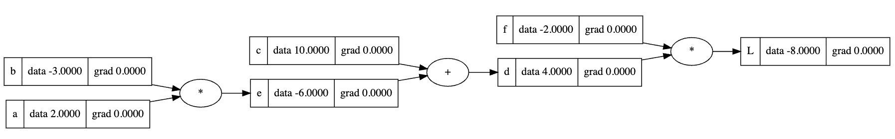

# 🧮 Micrograd Implementation (Learning Project)

This repository contains **my personal implementation of [micrograd](https://github.com/karpathy/micrograd)** — a tiny scalar-valued autograd engine with a small PyTorch-like neural network library built on top.

---

## ⚠️ Learning Disclaimer

This repository is **for educational and learning purposes only**.  
It is **not an original invention**, nor do I claim it as my own unique creation.  
This project is a **code-along implementation** inspired by the educational materials and tutorial by [Andrej Karpathy](https://www.youtube.com/watch?v=VMj-3S1tku0).  

The goal of this repository is to **document my personal learning journey** in understanding the fundamentals of **neural networks** and **backpropagation** by building everything from first principles.

---

## 🧠 About The Project

**Micrograd** is a tiny autograd engine that implements **reverse-mode autodifferentiation** over a dynamically built **directed acyclic graph (DAG)**, along with a simple neural network library.  
By constructing the logic manually, this implementation exposes what happens *"under the hood"* in modern deep learning frameworks like **PyTorch**.

This work follows the tutorial:  
🎥 [*The spelled-out intro to neural networks and backpropagation: building micrograd*](https://www.youtube.com/watch?v=VMj-3S1tku0)

---

## 🔑 Key Concepts Implemented

- **Value Object** – A scalar wrapper that tracks operations and gradients.  
- **Backpropagation** – Implementation of the chain rule for gradient computation.  
- **Neural Network Layers** – Hand-coded `Neuron`, `Layer`, and `MLP` classes.  
- **Visualization** – Integration with Graphviz for computational graph rendering.  
- **PyTorch Comparison** – Gradient consistency verification against PyTorch.

---

## 🛠️ Installation

Run the notebook or scripts using **Python 3.8+**.  
Install necessary dependencies using `pip`:

```bash
pip install numpy matplotlib graphviz torch
```

> **Note:**  
> - **torch** is used *only* for verification (to compare gradients with a production-grade library).  
> - **Graphviz** requires both the Python package and the system installation of Graphviz software to render computational graphs.

On Ubuntu/Debian, install Graphviz system package via:
```bash
sudo apt install graphviz
```

---

## 🚀 Usage Examples

### 1. Basic Autograd Example

```python
from micrograd import Value

# Define scalar values
a = Value(2.0, label='a')
b = Value(-3.0, label='b')
c = Value(10.0, label='c')

# Build the expression: L = (a * b + c) * f
e = a * b
d = e + c
f = Value(-2.0, label='f')
L = d * f

# Backward pass (Backpropagation)
L.backward()

print(f"L data: {L.data}")
print(f"a grad: {a.grad}")
print(f"b grad: {b.grad}")
```

---

### 2. Training a Neural Network (MLP)

```python
from micrograd import MLP, Value

# Initialize the model: 3 inputs, 2 hidden layers of 4 neurons, 1 output
model = MLP(3, [4, 4, 1])

# Dataset
xs = [
  [2.0, 3.0, -1.0],
  [3.0, -1.0, 0.5],
  [0.5, 1.0, 1.0],
  [1.0, 1.0, -1.0],
]
ys = [1.0, -1.0, -1.0, 1.0]

# Training loop
for k in range(20):
    ypred = [model(x) for x in xs]
    loss = sum(((yout - ygt)**2 for ygt, yout in zip(ys, ypred)), Value(0))
    
    # Zero gradients
    for p in model.parameters():
        p.grad = 0.0

    # Backward pass
    loss.backward()

    # Gradient Descent update
    for p in model.parameters():
        p.data += -0.05 * p.grad

    print(f"Step {k}, Loss: {loss.data}")
```

---

## 📊 Visualization

This project includes a function `draw_dot()` that visualizes the computation graph — extremely useful for understanding how gradients propagate through operations.  

If you've generated a visualization in your notebook, you can add an image here:

```markdown

```

---

## 📚 Credits & Resources

- **Original Author:** [Andrej Karpathy](https://karpathy.ai/)  
- **Tutorial Video:** [*The spelled-out intro to neural networks and backpropagation*](https://www.youtube.com/watch?v=VMj-3S1tku0)  
- **Original Repository:** [karpathy/micrograd](https://github.com/karpathy/micrograd)  

---

## 💡 License & Reuse

This repository is **strictly for learning and educational use**.  
You are welcome to follow, modify, and build upon it for your own studies.  
Please **credit the original sources** if you share your work publicly.

---
